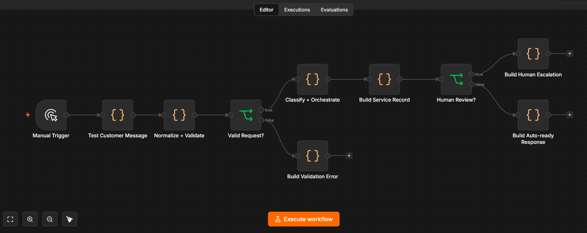
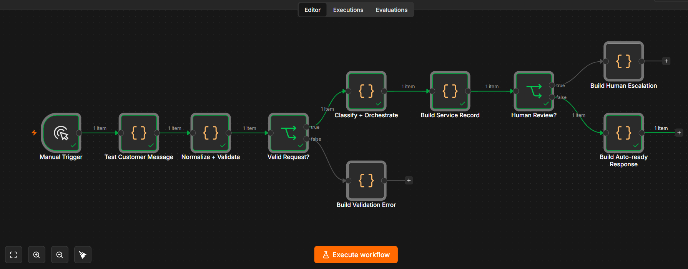
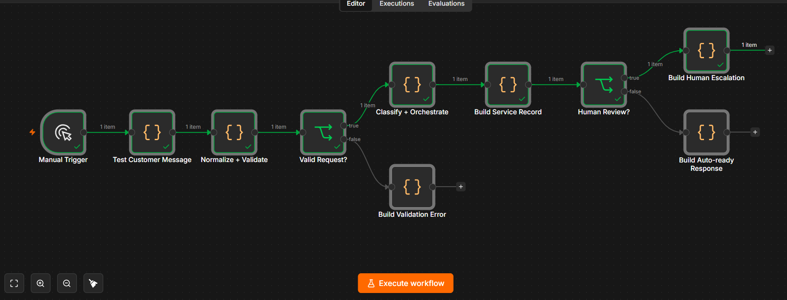
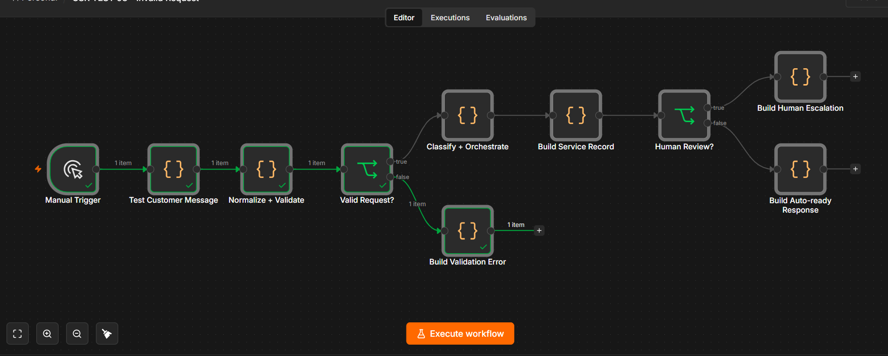

 # AI Customer Service / Receptionist Orchestration

> Production-minded portfolio reference implementation for customer-message intake, intent routing, booking preparation, safe response drafting, and human escalation.

**Author:** Tetiana Shtemberh  
**Role:** AI Automation & Implementation Specialist  
**Stack:** n8n · JavaScript · Webhooks-ready · REST API-ready · AI/LLM-ready · Human-in-the-loop

---

## Business Problem

Customer-facing teams receive booking requests, pricing questions, complaints, cancellations, and general enquiries across multiple channels.

A useful receptionist automation needs more than a generic chatbot response. It must validate incoming requests, identify operational intent, decide what can be processed safely, prepare the next action, and escalate sensitive cases to a human.

This project demonstrates that orchestration layer.

---

## Solution

The system processes structured customer messages through a deterministic service-orchestration pipeline.

It:

- normalizes incoming customer messages;
- validates required request data;
- classifies operational intent;
- detects urgent and sensitive cases;
- prepares deterministic next actions;
- generates safe draft responses;
- creates a stable interaction fingerprint;
- routes appropriate requests to an auto-ready path;
- routes complaints and sensitive cases to human review;
- rejects invalid requests before orchestration.

Reference intents include:

- `BOOKING`
- `RESCHEDULE_OR_CANCEL`
- `PRICING`
- `COMPLAINT`
- `HUMAN_REQUEST`
- `GENERAL`

---

## Architecture

```text
Customer Message
      ↓
Normalize + Validate
      ↓
Valid Request?
  ┌───┴───┐
 NO      YES
 ↓        ↓
Reject   Classify + Orchestrate
          ↓
     Service Record
          ↓
     Human Review?
       ┌──┴──┐
      YES    NO
       ↓      ↓
   Escalate  Auto-ready
```

The orchestration layer is intentionally provider-neutral.

Real messaging channels, CRM systems, calendars, knowledge bases, payment providers, or LLM services can be connected around the core workflow without changing its fundamental decision architecture.

---

## Workflow Overview



The workflow separates validation, classification, service-record creation, human-review decisions, and output preparation into explicit stages.

This makes the routing logic inspectable and allows individual execution paths to be tested independently.

---

## Intent Routing

### Booking

Messages containing booking or appointment intent are prepared for the booking workflow.

The reference implementation does **not** claim that a real calendar reservation has been created.

Instead, it prepares the next operational action:

```text
COLLECT_OR_CONFIRM_BOOKING_DETAILS
```

A production calendar integration can then check real availability before confirming an appointment.

### Pricing

Pricing-related enquiries can be prepared for approved pricing information.

```text
SEND_APPROVED_PRICING_INFORMATION
```

### Complaint

Complaint, refund, or other sensitive customer-service messages are escalated instead of being resolved autonomously.

```text
ESCALATE_TO_HUMAN
```

### Human Request

Explicit requests for a person, manager, or human agent are routed to human review.

### General Requests

Requests that do not require escalation can be prepared for the next normal service step.

---

## Human-in-the-loop Logic

Human review is required when the workflow detects conditions such as:

- complaints;
- refund-related language;
- explicit requests for a human or manager;
- urgent or emergency language;
- sensitive customer-service situations;
- low-confidence classification.

This prevents high-impact or sensitive interactions from being treated as fully autonomous customer-service decisions.

---

## Safety Boundary

This reference implementation does **not** claim to perform:

- live calendar booking;
- payment processing;
- medical advice;
- autonomous complaint resolution;
- autonomous refunds;
- production CRM updates;
- production messaging;
- unrestricted AI-generated customer responses.

External services can be connected downstream in a production implementation.

Draft responses represent prepared communication, not proof that an appointment, payment, refund, or transaction has been completed.

---

## Demo & Evidence

The core orchestration logic was executed in n8n using synthetic customer messages and isolated manual test workflows.

### Test 1 — Booking Request → Auto-ready

A valid customer message requesting an appointment successfully passed validation and classification.

The workflow followed:

```text
Valid Request? → TRUE
Human Review? → FALSE
Build Auto-ready Response
```

**Expected result:** `AUTO_READY`



---

### Test 2 — Complaint → Human Review

A synthetic customer complaint included dissatisfaction, a refund request, and a request for a manager.

The workflow correctly followed:

```text
Valid Request? → TRUE
Human Review? → TRUE
Build Human Escalation
```

The automatic-response branch was not executed.

**Expected result:** human escalation.



---

### Test 3 — Invalid Request → Validation Error

A request with missing required information was executed through the validation layer.

The workflow correctly followed:

```text
Valid Request? → FALSE
Build Validation Error
```

Classification and customer-service orchestration were not executed.

**Expected result:** controlled validation rejection.



---

## Test Matrix

| Scenario | Expected Result | Tested |
|---|---|---|
| Valid booking request | Auto-ready | ✅ |
| Complaint / refund request | Human review | ✅ |
| Manager / human escalation request | Human review | ✅ |
| Missing required request data | Validation rejection | ✅ |

The complaint scenario intentionally combined several escalation signals to verify the human-review route.

---

## Interaction Fingerprinting

The workflow creates a deterministic interaction identifier from normalized message attributes.

This demonstrates a foundation for:

- interaction correlation;
- duplicate detection;
- idempotency;
- audit references;
- downstream record matching.

Persistent duplicate detection or idempotency storage would be added in a production deployment.

---

## Reliability Considerations

### Implemented in the workflow

- deterministic normalization;
- required-field validation;
- supported-channel validation;
- deterministic reference intent classification;
- explicit escalation conditions;
- urgent/sensitive-message detection;
- deterministic next-action selection;
- controlled draft-response preparation;
- stable interaction fingerprint;
- explicit auto-ready branch;
- explicit human-review branch;
- controlled validation-error path.

### Documented for production implementation

A production deployment should additionally include:

- persistent conversation state;
- persistent idempotency storage;
- persistent duplicate detection;
- authenticated channel webhooks;
- retries with exponential backoff;
- API rate-limit handling;
- structured operational logging;
- failure alerts;
- persistent human-review queues;
- CRM synchronization;
- real calendar availability checks;
- approved knowledge-base retrieval;
- secrets management;
- audit history;
- data-retention controls.

These capabilities are production extensions and are not represented as already implemented integrations.

---

## AI / LLM Integration

The tested core is intentionally deterministic and does not require a paid AI API.

An LLM can later assist with:

- free-form intent classification;
- multilingual customer messages;
- conversation summarization;
- retrieval-grounded response drafting;
- knowledge-base question answering;
- structured information extraction.

High-impact actions should remain constrained by deterministic business rules, approved data sources, and human escalation.

This architecture keeps the core system testable while allowing AI capabilities to be added where they provide measurable value.

---

## Provider-neutral Design

The workflow is not tied to a specific messaging, CRM, calendar, or AI provider.

A production architecture could follow:

```text
WhatsApp / Instagram / Email / Web
                ↓
        Customer Message
                ↓
     Receptionist Orchestration
                ↓
      ┌─────────┼─────────┐
      ↓         ↓         ↓
   Calendar    CRM    Human Review
      ↓         ↓         ↓
        Approved Response
                ↓
        Messaging Channel
```

Individual providers can therefore be replaced without redesigning the central orchestration logic.

---

## Production Extension Example

A production booking flow could extend the tested architecture as follows:

```text
Booking Intent
      ↓
Validate Customer Data
      ↓
Check Calendar Availability
      ↓
Available?
  ┌───┴───┐
 YES      NO
  ↓        ↓
Prepare   Offer Alternative
Booking   Time Slots
  ↓
Human / Policy Check
  ↓
Confirm Booking
  ↓
CRM + Customer Notification
```

The current repository demonstrates the orchestration layer rather than claiming these external integrations are already live.

---

## Repository Contents

The repository includes:

- n8n workflow export;
- isolated n8n test workflows;
- synthetic customer-message samples;
- testing documentation;
- production notes;
- environment-variable placeholders;
- tested workflow evidence.

No client data, production credentials, or secrets are included.

---

## Setup

1. Import the workflow JSON into n8n.
2. Review the validation and orchestration nodes.
3. Use the included synthetic test workflows for execution testing.
4. Configure real external credentials only when adding production integrations.
5. Keep secrets outside exported workflow files.

The deterministic reference implementation can be executed without a paid external API.

---

## Security

This repository intentionally contains:

- no API keys;
- no production credentials;
- no real customer conversations;
- no client data;
- no private infrastructure configuration.

Production messaging and customer-service systems should additionally implement authentication, authorization, encryption, audit logging, data-retention controls, and appropriate access restrictions.

---

## Portfolio Status

**Working reference implementation**

The deterministic customer-service orchestration core has been executed and validated in n8n using synthetic data across three distinct paths:

- booking request → auto-ready;
- complaint → human review;
- invalid request → validation error.

Live messaging, CRM, calendar, payment, knowledge-base, and AI integrations are production architecture components and are not represented as tested live integrations.

---

## What This Project Demonstrates

This project demonstrates practical automation engineering beyond a basic chatbot:

- customer-message validation;
- intent-based orchestration;
- business-rule translation;
- safe automation boundaries;
- human-in-the-loop routing;
- exception handling;
- deterministic decision logic;
- interaction fingerprinting;
- provider-neutral architecture;
- failure-aware design;
- testable automation;
- honest separation between implemented and production-planned capabilities.

---

## Portfolio

Built by **Tetiana Shtemberh**  
**AI Automation & Implementation Specialist**

`n8n · Make · REST APIs · Webhooks · JavaScript · AI/LLM · CRM · Google Workspace · Business Process Automation`
